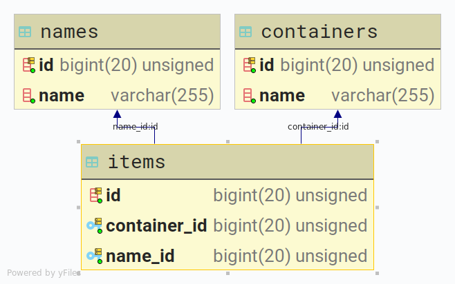

# Lamoda PHP Quest

Вариант выполнения задания предложенного в статье - [Let's play a little game with Lamoda](https://habr.com/ru/company/lamoda/blog/460999/) и направленного на указанный в анкете участника адрес электронной почты. 

Текст задания в файле [PHP_Quest.pdf](PHP_Quest.pdf).

## Общее описание
<p align="center"></p>

На основании условий задачи, реализация основана на фреймворке Laravel и исходит из следующих предположений:
1. Создание контейнера осуществляется путем передачи сервису структурированных, json сериализованных данных, содержащих один или несколько экземпляров контейнеров включающих экземпляры товаров.
2. Под созданием контейнера подразумевается процесс сохранения параметров переданных элементов для их дальнейшего анализа и обработки.
3. Идентификаторы элементов определены в запросе на создание (сохранение элементов) к сервису.
4. Идентификаторы контейнеров и товаров уникальны (предположение основано на статье [habr.com/ru/company/lamoda/blog/432394/](https://habr.com/ru/company/lamoda/blog/432394/), наименования нет.
5. Товары (количество и сочетание) распределены по контейнерам в произвольом порядке. Используемая в тексте задачи формулировка "_Товары в контейнерах распределены случайным, но известным образом._" неоднозначна и требует пояснений. Товары **по контейнерам** или **товары в рамках контейнера**?
6. В ответ на запрос списка контейнеров желательно вернуть список контенеров включающий список товаров (расширенная трактовка задания). 

##### Алгоритм определения списка контейнеров с уникальными товарами
Базовая идея - в контексте реализованного сервиса, контейнер (идентификатор контейнера) - свойство товара. Алгоритм определения списка контейнеров основан на методе **groupBy**, в качестве передаваемого параметра используется внутренний идентификатор имени товара. В полученной коллекции товаров, методом определения соответсвия количеству (1) товаров в группе имен, выделяются идентификаторы контейнеров (исключая дубликаты), и на их основании строится результирующий вывод. Если упрощать, то товары группируются по имени, а затем, если имя встречается в единственном числе, из свойств товара выделяется идентификатор контейнера который коллекционируется для вывода. 

Интерфейс метода реализован как через API, так и через CLI.

##### Алгоритм генерации тестовых данных
Алгоритм генерации элементов (контейнер, товар, имя) основан на т.н. фабрике - компоненте фреймворка. Логика простая, но требует пояснений. Детали реализации в конце этого документа.

Интерфейс реализован через CLI.

## Тестовый сервер

- Ubuntu 18.04.2 LTS
- nginx/1.14.0
- PHP 7.2.19
- Laravel v5.8.29
- Git
- Composer

Реализован: [http://185.251.38.197](http://185.251.38.197)

## REST JSON API Маршруты
##### Основной, принимает  на сохранение контейнера/контейнеров. Примеры передаваемых данных в директории /docs/samples
- **POST**(json) [http://185.251.38.197/hook](http://185.251.38.197/hook)

##### Получение списка контейнеров с уникальными товарами
- **GET**(пустой) [http://185.251.38.197/containers-with-unique-items](http://185.251.38.197/containers-with-unique-items)

##### Получение конкретного контейнера по его идентификатору
- **GET**(/id)  [http://185.251.38.197/container/id](http://185.251.38.197/container/55435515)

## Ответы сервиса

Ответы на входящие запросы формируются в json (код ответа сервера 200). Ответом на успешную обработку запроса на получения списка контейнеров/контейнера будет json следующей структуры:
```
{
    "id": 778,
    "name": "FakeEsta",
    "items": [{
        "id": 771,
        "name": "FakeDarleneAzure"
    }, {
        "id": 7772,
        "name": "FakeJannieMintCream"
    }, {
        "id": 7773,
        "name": "FakeHerthaSeaShell"
    }, {
        "id": 7774,
        "name": "FakeJaydaLightSkyBlue"
    }, {
        "id": 7775,
        "name": "FakeEudoraTurquoise"
    }, {
        "id": 7776,
        "name": "FakeBiankaPaleGreen"
    }, {
        "id": 7777,
        "name": "FakeAnnabelNavajoWhite"
    }, {
        "id": 7778,
        "name": "FakeEstefaniaBeige"
    }, {
        "id": 7779,
        "name": "FakeOzellaSlateBlue"
    }, {
        "id": 7780,
        "name": "FakeErickaTurquoise"
    }]
}
``` 

При успешном выполнении запроса на сохранение данных с одним конейнером:
```
{
    "success": true,
    "description": "Container #778 successfully stored",
    "error": false,
    "error_description": ""
}
```

Несколько контейнеров:
```
{
    "success": true,
    "description": "10 containers successfully stored",
    "error": false,
    "error_description": ""
}
```

Пример ответа на неуспешную обработку запроса на сохранение данных:
```
{
    "success": false,
    "description": "",
    "error": true,
    "error_description": "Probably duplicate entry"
}
```

При обработке ошибок парсинга запроса используются исключения. В штатных ситуациях генерируются стандартные HTTP status code. Проверка структуры входных данный реализована на базовом уровне и, в случае корректировки условий задачи, должна быть скорректирована/расширена.

## Установка

Клонирование репозитория и подготовка к установке:
```
$ git clone https://github.com/skodnik/Lamoda-PHP-Quest.git laravel-app
$ cd ~/laravel-app
$ cp env.example .env
```

Устновка через docker:
```
$ docker run --rm -v $(pwd):/app composer install
$ docker-compose up -d
$ docker ps
```

Пример вывода, тут нужно взять CONTAINER ID app и использовать на следующем шаге:
```
CONTAINER ID        IMAGE                  COMMAND                  CREATED             STATUS              PORTS                                      NAMES
239c5ff2437f        digitalocean.com/php   "docker-php-entrypoi…"   28 seconds ago      Up 25 seconds       9000/tcp                                   app
4fd62e203516        nginx:alpine           "nginx -g 'daemon of…"   28 seconds ago      Up 25 seconds       0.0.0.0:80->80/tcp, 0.0.0.0:443->443/tcp   webserver
```

Настройка Laravel:
```
$ docker exec -it 239c5ff2437f /bin/bash
$ php artisan key:generate
$ touch database/database.sqlite
$ php artisan migrate
```

Дополнение. Параметры. Размещены в .env
```
QUANTITY_CONTAINERS=100
QUANTITY_NAMES=400
QUANTITY_ITEMS_IN_CONTAINER=10
QUANTITY_UNIQUE_NAMES=100
```

## Генератор данных

Генератор реализован средствами фабрик фреймворка. Управление производится через консоль. Параметры для генерации случайных данных указаны в файле .env

Генерация элементов:
```
$ php artisan fake:make 
```

Пример вывода:
```
//////////////////////////////////////
Fake maker init
Start: 28 July 20:47:01
Fake init params:
+---------------------+-----------------------------+-----------------------+----------------+
| QUANTITY_CONTAINERS | QUANTITY_ITEMS_IN_CONTAINER | QUANTITY_UNIQUE_NAMES | QUANTITY_NAMES |
+---------------------+-----------------------------+-----------------------+----------------+
| 100                 | 10                          | 100                   | 400            |
+---------------------+-----------------------------+-----------------------+----------------+
Fake maker well done
End: 28 July 20:47:11
//////////////////////////////////////
```

Получение списка контейнеров:
```
$ php artisan fake:get 
```

Пример вывода списка контейнеров содержащих уникальные товары:
```
//////////////////////////////////////
Fake get info
Start: 28 July 21:06:06
Fake init params:
+---------------------+-----------------------------+-----------------------+----------------+
| QUANTITY_CONTAINERS | QUANTITY_ITEMS_IN_CONTAINER | QUANTITY_UNIQUE_NAMES | QUANTITY_NAMES |
+---------------------+-----------------------------+-----------------------+----------------+
| 100                 | 10                          | 100                   | 400            |
+---------------------+-----------------------------+-----------------------+----------------+
Containers with unique items list:
+----------+------------+
| id       | name       |
+----------+------------+
| 55435515 | Brigitte   |
| 85065043 | Selina     |
| 66962196 | Gilda      |

 ...

| 92627071 | Krista     |
| 4205824  | Dena       |
| 94496104 | Marquise   |
+----------+------------+
***********************************
*     Containers quantity: 64     *
***********************************

Fake get info well done
End: 28 July 21:06:06
//////////////////////////////////////
```

## Тесты
```
$ php vendor/bin/phpunit tests/Feature/BasicTests.php
```

Пример результата:
```
PHPUnit 7.5.14 by Sebastian Bergmann and contributors.

..........                                                        10 / 10 (100%)

Time: 1.06 seconds, Memory: 20.00 MB

OK (10 tests, 24 assertions)
```

## OPEN API
[api.yml](/app/docs/openapi/api.yml)


## Структура базы данных


## Логика генератора:
1. Определеяется массив идентификаторов в рамках от 1 до значения (QUANTITY_NAMES) указанного в параметрах, в файле .env.
2. Полученный массив перемешивается и срезается на значение определенное в константе (QUANTITY_UNIQUE_NAMES). В результате формируются два массива, один с идентификаторами уникальных имен, второй с идентификаторами повторяющихся имен.
3. К первому массиву добавляется второй до тех пор, пока итоговое количество ключей массива не будет равно итоговому количеству товаров, рассчитываемое по формуле количество контейнеров * емкость.
4. Получившийся массив имен перемешивается и его элементы по порядку выдаются фабрике для создания элементов.
