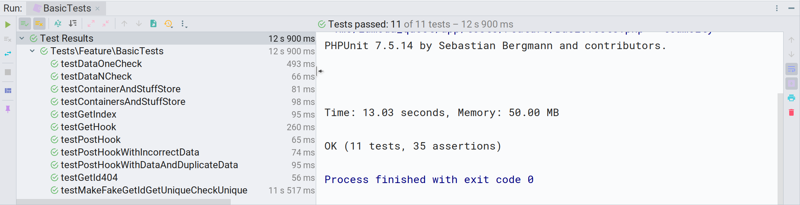

# Lamoda PHP Quest

Вариант выполнения задания предложенного в статье - [Let's play a little game with Lamoda](https://habr.com/ru/company/lamoda/blog/460999/) и направленного на указанный в анкете участника адрес электронной почты. 

Текст задания в файле [PHP_Quest.pdf](PHP_Quest.pdf).

## Общее описание
<p align="center"></p>

На основании условий задачи, реализация основана на фреймворке Laravel и исходит из следующих предположений:
1. Создание контейнера осуществляется путем передачи сервису структурированных, json сериализованных данных, содержащих один или несколько экземпляров контейнеров включающих экземпляры товаров.
2. Под созданием контейнера подразумевается процесс сохранения параметров переданных элементов для их дальнейшего анализа и обработки.
3. Идентификаторы элементов определены в запросе на создание (сохранение элементов) к сервису.
4. Идентификаторы контейнеров и товаров уникальны (предположение основано на статье [habr.com/ru/company/lamoda/blog/432394/](https://habr.com/ru/company/lamoda/blog/432394/), наименования нет.
5. Товары (количество и сочетание) распределены по контейнерам в произвольном порядке. Используемая в тексте задачи формулировка "_Товары в контейнерах распределены случайным, но известным образом._" неоднозначна и требует пояснений. Но, полагаю, имеется ввиду то, что финальный порядок известен, т.е. есть список сформированных котнейнеров содержащих список товаров.
6. В ответ на запрос списка контейнеров желательно вернуть список контенеров включающий список товаров (расширенная трактовка задания). 
7. Схема взаимодействия следующая: Склад формирует 1 000 контейнеров из 10 000 товаров и передает через API в программируемый Веб-сервис информацию о контейнерах (id, название, список товаров). Веб-сервис хранит информацию о контейнерах и товарах. Фотостудия обращается к Веб-сервису через API и получает список контейнеров с уникальными товарами, или один контейнер. 

##### Алгоритм определения списка контейнеров с уникальными товарами
Базовая идея - группировка товаров по наименованию. Получив список контейнеров с товарами, сервис разбирает контейнеры по группам товаров, а затем, из каждой группы выбирает определенный (можно любой, можно параметризированный...) товар, и его свойство - идентификатор контейнера, собирая массив идентификаторов контейнеров исключая дубликаты. Так мы можем быть уверены в том, что каждый из товаров будет в перечне контейнеров, а нагрузка на сервис не высока.

Важно обратить внимание, что реализованный способ создает выборку контейнеров с идентификаторами идущими по порядку. Это может иметь немаловажное значение для склада, т.к. вероятнее всего, паллеты контейнеров для транспортировки, формируются по порядку идентификаторов контейнеров, таким образом, для предоставления запрошенных фотостудией контейнеров, сотруднику склада потребуется минимум усилий и времени.

Предложение основано на экономии ресурсов сервиса. В случае увеличения количества контейнеров, можно адаптировать функционал генераторами. Для оптимизации списка контейнеров можно расширить функционалом просчета всех вариантов и выбора наименьшего числа контейнеров.

Интерфейс метода реализован как через API, так и через CLI.

##### Алгоритм генерации тестовых данных
Алгоритм генерации элементов (контейнер, товар, имя) основан на т.н. фабрике - компоненте фреймворка.

Интерфейс реализован через CLI.

## Тестовый сервер

- Ubuntu 18.04.2 LTS
- nginx/1.14.0
- PHP 7.2.19
- Laravel v5.8.29
- Git
- Composer

Реализован: [http://185.251.38.197](http://185.251.38.197)

## REST JSON API Маршруты
##### Основной, принимает  на сохранение контейнер/контейнеры. Примеры передаваемых данных в директории /docs/samples
- **POST**(json) [http://185.251.38.197/hook](http://185.251.38.197/hook)

##### Получение списка контейнеров с уникальными товарами
- **GET**(пустой) [http://185.251.38.197/containers-with-unique-items](http://185.251.38.197/containers-with-unique-items)

##### Получение конкретного контейнера по его идентификатору
- **GET**(/id)  [http://185.251.38.197/container/id](http://185.251.38.197/container/39)

## Ответы сервиса

Ответы на входящие запросы формируются в json (код ответа сервера 200). Ответом на успешную обработку запроса на получения списка контейнеров/контейнера будет json следующей структуры:
```
{
    "id": 778,
    "name": "FakeEsta",
    "items": [{
        "id": 771,
        "name": "FakeDarleneAzure"
    }, {
        "id": 7772,
        "name": "FakeJannieMintCream"
    }, {
        "id": 7773,
        "name": "FakeHerthaSeaShell"
    }, {
        "id": 7774,
        "name": "FakeJaydaLightSkyBlue"
    }, {
        "id": 7775,
        "name": "FakeEudoraTurquoise"
    }, {
        "id": 7776,
        "name": "FakeBiankaPaleGreen"
    }, {
        "id": 7777,
        "name": "FakeAnnabelNavajoWhite"
    }, {
        "id": 7778,
        "name": "FakeEstefaniaBeige"
    }, {
        "id": 7779,
        "name": "FakeOzellaSlateBlue"
    }, {
        "id": 7780,
        "name": "FakeErickaTurquoise"
    }]
}
``` 

При успешном выполнении запроса на сохранение данных с одним контейнером:
```
{
    "success": true,
    "description": "Container #778 successfully stored",
    "error": false,
    "error_description": ""
}
```

Несколько контейнеров:
```
{
    "success": true,
    "description": "10 containers successfully stored",
    "error": false,
    "error_description": ""
}
```

Пример ответа на неуспешную обработку запроса на сохранение данных:
```
{
    "success": false,
    "description": "",
    "error": true,
    "error_description": "Probably duplicate entry"
}
```

При обработке ошибок парсинга запроса используются исключения. В штатных ситуациях генерируются стандартные HTTP status code. Проверка структуры входных данный реализована на базовом уровне и, в случае корректировки условий задачи, должна быть скорректирована/расширена.

## Установка

Клонирование репозитория и подготовка к установке:
```
$ git clone --single-branch --branch unique_names https://github.com/skodnik/Lamoda-PHP-Quest.git laravel-app
$ cd ~/laravel-app
$ cp env.example .env
```

Устновка через docker:
```
$ docker run --rm -v $(pwd):/app composer install
$ docker-compose up -d
$ docker ps
```

Пример вывода, тут нужно взять CONTAINER ID app и использовать на следующем шаге:
```
CONTAINER ID        IMAGE                  COMMAND                  CREATED             STATUS              PORTS                                      NAMES
239c5ff2437f        digitalocean.com/php   "docker-php-entrypoi…"   28 seconds ago      Up 25 seconds       9000/tcp                                   app
4fd62e203516        nginx:alpine           "nginx -g 'daemon of…"   28 seconds ago      Up 25 seconds       0.0.0.0:80->80/tcp, 0.0.0.0:443->443/tcp   webserver
```

Настройка Laravel:
```
$ docker exec -it 239c5ff2437f /bin/bash
$ php artisan key:generate
$ touch database/database.sqlite
$ php artisan migrate
```

Дополнение. Параметры. Размещены в .env
```
# Генерировать ключи автоматически
# После изменения обязательно migrate:fresh
INCREMENT_IDS=1

# Параметры генерируемых данных
QUANTITY_CONTAINERS=1000
QUANTITY_ITEMS_IN_CONTAINER=10
QUANTITY_UNIQUE_NAMES=100
```

## Генератор данных

Генератор реализован средствами фабрик фреймворка. Управление производится через консоль. Параметры для генерации случайных данных указаны в файле .env

Генерация элементов:
```
$ php artisan migrate:fresh 
$ php artisan fake:make 
```

Пример вывода:
```
//////////////////////////////////////
Fake maker init
Start: 1 August 07:20:03
Fake init params:
+---------------------+-----------------------------+-----------------------+
| QUANTITY_CONTAINERS | QUANTITY_ITEMS_IN_CONTAINER | QUANTITY_UNIQUE_NAMES |
+---------------------+-----------------------------+-----------------------+
| 1000                | 10                          | 100                   |
+---------------------+-----------------------------+-----------------------+
Fake maker well done
End: 1 August 07:20:39
//////////////////////////////////////
```

Получение списка контейнеров:
```
$ php artisan fake:get 
```

Пример вывода списка контейнеров содержащих уникальные товары:
```
//////////////////////////////////////
Fake get info
Start: 1 August 07:21:01
Fake init params:
+---------------------+-----------------------------+-----------------------+
| QUANTITY_CONTAINERS | QUANTITY_ITEMS_IN_CONTAINER | QUANTITY_UNIQUE_NAMES |
+---------------------+-----------------------------+-----------------------+
| 1000                | 10                          | 100                   |
+---------------------+-----------------------------+-----------------------+
Containers with unique items list:
+----+----------+
| id | name     |
+----+----------+
| 1  | Ettie    |
| 2  | Amie     |
| 3  | Grace    |
...
| 30 | Flo      |
| 39 | Evelyn   |
| 40 | Myra     |
+----+----------+
***************************************************************
*     Containers quantity: 30, unique names quantity: 100     *
***************************************************************

Fake get info well done
End: 1 August 07:21:02
//////////////////////////////////////
```

## Тесты
```
$ php vendor/bin/phpunit tests/Feature/BasicTests.php
```
В процессе тестирования спользуются параметры данных определяемые в файле конфигурации окружения .env

Проверяются:
1. Маршруты API, доступность, коды ответов, реакция на некорректные запросы
2. Работа генератора случайных данных, соответствие результата заданным параметрам
3. Метод определения и формирования перечня контейнеров содержащих все позиции ассортимента
4. Коррректность полученных данных путем определения числа "уникальных товаров" и сравнения его с заявленным ассортиментом
5. Метод отдающий один контейнер
5. Методы контроля структуры входных данных
6. Методы записи и чтения

Пример результата:


В качестве дополнения (факультатива) тестирование оптимальности используемого алгоритма. Так как метод формирования списка контейнеров с товарами всех 100 наименований основан на группировке имен, имеется прогнозируемая возможность оценить оптимальность выборки. Данный тест стоит рассматривать как условный, не исключительный способ оценки оптимальности в рамках групп наименований товаров.

В процессе исполнения теста каждый раз генерируются новые тестовые данные. Для наглядности вариативности выводятся количество получаемых и минимальное расчетное в выборке количество контейнеров.

```
$ php vendor/bin/phpunit tests/Feature/AlgorithmOptimalityTests.php
```

Пример результата:
```
PHPUnit 7.5.14 by Sebastian Bergmann and contributors.

. 1 / 1 (100%)

Containers from the result: 26 estimated minimum: 26

Time: 12.26 seconds, Memory: 48.00 MB

OK (1 test, 6 assertions)
```

## OPEN API
[api.yml](/app/docs/openapi/api.yml)


## Структура базы данных

